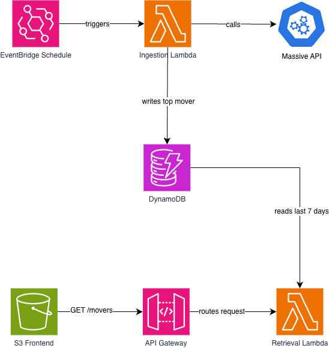

# Stocks Serverless Pipeline

## Description

Checks a list of tech stocks to see which one moved the most each day, saves the result, and shows the last 7 days on a webpage.

### AWS Architecture



EventBridge triggers a daily ingestion Lambda that fetches stock data from the Massive API, computes the top mover, and stores the result in DynamoDB. A static frontend hosted on S3 calls the `GET /movers` API Gateway endpoint, which invokes a retrieval Lambda to return the results from the last 7 days.

### Setup

1. Clone the repo

2. Create a `.env` file:

```env
STOCK_API_KEY=your_key_here
```

[Use this link to get your API key](https://massive.com/dashboard)

3. Install dependencies:

```bash
pip install -r backend/requirements.txt
npm install
```

4. Configure AWS credentials:

```bash
aws configure
```

5. Install Serverless Framework

```bash
npm install -g serverless
```

Verify the installation:

```bash
serverless --version
```

6. Deploy

```bash
serverless deploy
```

This command will:

- Deploy both the ingest and retrieve Lambda functions 
- Create the DynamoDB table
- Set up API Gateway (GET /movers)
- Create the S3 static website bucket 
- Upload frontend files to S3 

7. Seed initial data

To backfill the last 7 business days:

```bash
python scripts/backfill.py
```
